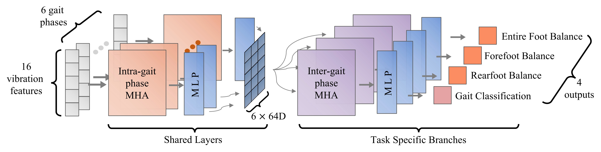
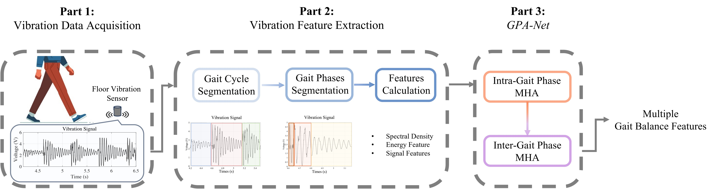
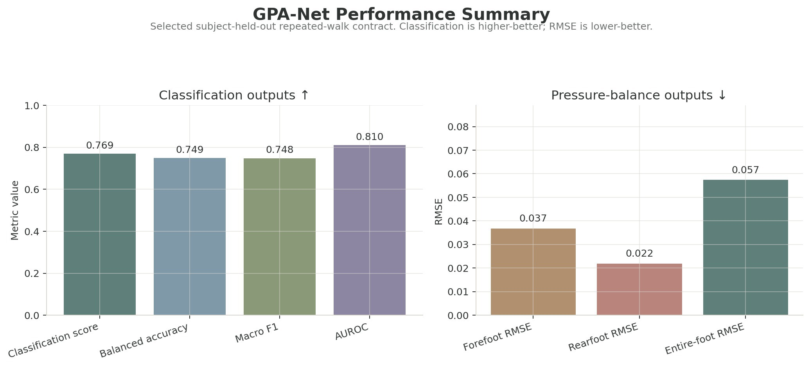
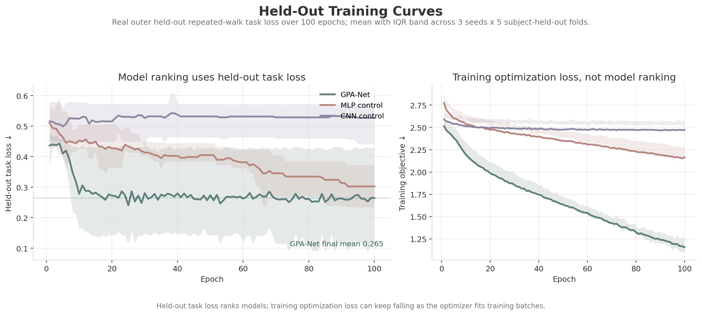
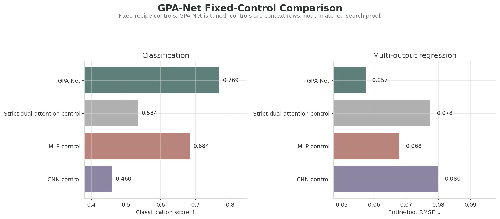
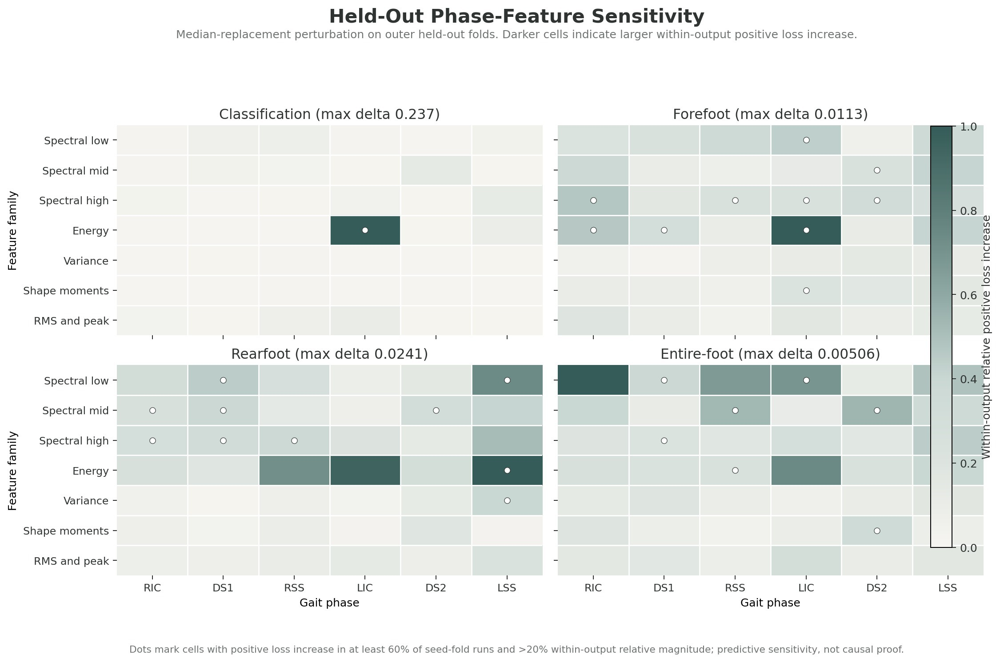
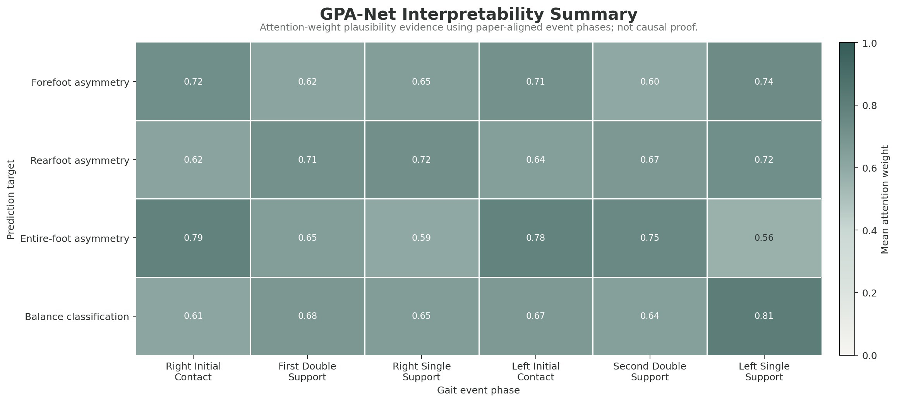

# GPA-Net

GPA-Net estimates gait pressure-balance asymmetry from footstep-induced floor vibrations using a dual-attention, multi-output model.



## Why GPA-Net

Gait balance is usually measured with pressure mats, wearables, cameras, or direct clinical observation. GPA-Net keeps the sensing surface passive: floor vibration sensors capture footsteps while pressure-derived labels define the supervised targets.

The release is scoped to subject-held-out repeated-walk inference. Repeated-walk inference is not a single-trial replacement. Reported point estimates are descriptive rather than statistically tested claims.

## Method Overview

GPA-Net uses a dual-attention stack. Intra-phase feature attention summarizes vibration features within each gait phase, then inter-phase, task-specific attention relates the six phases to each output task. Shared layers and task-specific heads produce the multi-output prediction package.

The model consumes 96 phase-structured vibration features plus one scalar side channel. Each phase contributes 16 physically interpretable features covering spectral density, signal energy, and time-domain signal shape.



## Gait-Phase Features

The six event-based gait phases are Right Initial Contact, First Double Support, Right Single Support, Left Initial Contact, Second Double Support, and Left Single Support. These names follow the GPA-Net paper definitions and are used consistently across the release docs.

The three regression targets are forefoot pressure-balance asymmetry (UpperAsymmetry), rearfoot pressure-balance asymmetry (LowerAsymmetry), and entire-foot pressure-balance asymmetry (TotalAsymmetry). The binary classification head predicts the abnormal-condition label derived from `condition_label` (class 1 for abnormal, class 0 otherwise).

## Results

The headline row is GPA-Net under the selected same-scope contract: `subject_id` GroupKFold with prediction-time repeated-walk mean fusion. Classification metrics are higher-better; RMSE metrics are lower-better. Diagnostic, ablation, and support rows are documented in [the evidence notes](docs/evidence.md) rather than promoted in the main table.
The bounded public claim policy is recorded in [docs/claim_scope.md](docs/claim_scope.md).





The curve uses real subject-held-out repeated-walk task loss over 100 epochs, 3 seeds, and 5 folds. Lines are means and shaded bands are interquartile ranges across 15 seed-fold blocks. Lower held-out loss indicates stronger performance under the fixed-control evaluation contract; the training optimization panel is shown for convergence context only.

| Method | Scope | Classification score ↑ | Balanced accuracy ↑ | Macro F1 ↑ | AUROC ↑ | Forefoot RMSE ↓ | Rearfoot RMSE ↓ | Entire-foot RMSE ↓ |
| --- | --- | ---: | ---: | ---: | ---: | ---: | ---: | ---: |
| GPA-Net | subject-held-out repeated-walk | 0.7689 | 0.7487 | 0.7483 | 0.8098 | 0.0368 | 0.0219 | 0.0574 |

## Ablation And Interpretability

The README control view compares the selected GPA-Net recipe with fixed-recipe architectural controls. GPA-Net is strongest in this fixed-control view, but this is not a matched-search architecture proof. The stricter first/second-attention ablation is kept in [the evidence notes](docs/evidence.md).



Attention and interpretability panels are plausibility evidence, not causal proof. They are useful for checking whether learned salience is biomechanically coherent, not for proving that one phase causes an output.



The sensitivity map perturbs phase-specific feature families on held-out folds and reports within-output positive loss increase. `RIC` is Right Initial Contact, `DS1` First Double Support, `RSS` Right Single Support, `LIC` Left Initial Contact, `DS2` Second Double Support, and `LSS` Left Single Support. It is predictive sensitivity, not causal proof.



## Quickstart

```bash
conda env create -f environment.yml
conda activate gpa-net
python scripts/validate_release.py
python scripts/reproduce_gpa_net.py --help
```

Raw data are not bundled. Provide an authorized canonical CSV that follows [the data contract](docs/data_contract.md).

## Data Contract

The expected CSV contains `feature_001` through `feature_097`, subject/trial metadata, pressure summary columns, and target-construction inputs. See [docs/data_contract.md](docs/data_contract.md) and [data/README.md](data/README.md).

## Repository Layout

```text
gpa-net/
|-- README.md
|-- environment.yml
|-- assets/figures/
|-- data/
|-- docs/
|-- scripts/
|-- src/gpanet/
`-- tests/
```

Long-form evidence, reproduction notes, claim-scope policy, and the public-to-internal method map live under [docs/](docs/).

## Reproduce

Use the release-local wrapper for supported recipes:

```bash
python scripts/reproduce_gpa_net.py --list-recipes
python scripts/reproduce_gpa_net.py --recipe gpa_net_final --data data/canonical_dataset.csv
python scripts/validate_release.py
```

The wrapper prints portable release commands and keeps historical source paths in supporting docs. It does not depend on a local workspace virtual environment.

Reader guide:

- [docs/method.md](docs/method.md): six gait phases, the paper-derived gait-cycle label mapping, and the public dual-attention description.
- [docs/reproduction.md](docs/reproduction.md): release-local validation and supported reproduction recipes.
- [docs/evidence.md](docs/evidence.md): supporting rows, canonical public roles, figure provenance, and artifact hashes.
- [docs/claim_scope.md](docs/claim_scope.md): supported and unsupported public claims.
- [docs/method_code_map.md](docs/method_code_map.md): readable public names mapped to internal experiment IDs.

## Citation, License, And Data Access

For academic citation, cite the GPA-Net paper: "Human-Centered Gait Balance Estimation Using Footstep-Induced Floor Vibrations," HumanSys 2025, DOI `10.1145/3722570.3726886`.

License pending.

Dataset access pending permission verification.
