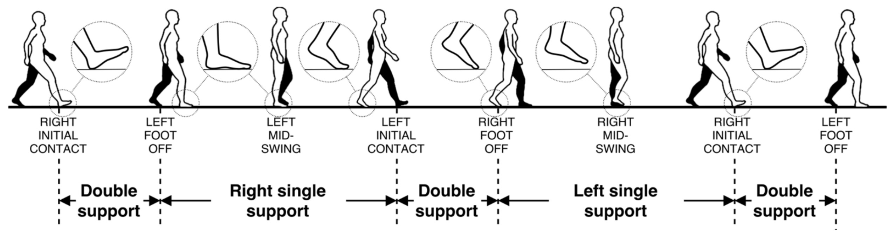

# GPA-Net Method Notes

GPA-Net estimates gait pressure-balance asymmetry from floor vibrations induced by footsteps. The public method description uses the paper terminology first: gait phases, a dual-attention stack, and shared/task-specific multi-output heads.

## Gait Cycle And Six Phases

A gait cycle is segmented from foot contact and foot-off events. GPA-Net uses these six event-based phases:

1. Right Initial Contact
2. First Double Support
3. Right Single Support
4. Left Initial Contact
5. Second Double Support
6. Left Single Support

Each phase contributes a local vibration window. Right Initial Contact and Left Initial Contact are contact-centered event windows; the double-support and single-support labels are support intervals. The release uses these phase names in public docs and figures so the implementation narrative stays aligned with the paper rather than generic stance/swing labels.

The paper-derived schematic mixes event labels and support-interval labels. Use the mapping below when reading the image so the figure stays aligned with the six release phase names.

| Schematic label or interval | Release phase name |
| --- | --- |
| `RIGHT INITIAL CONTACT` event | Right Initial Contact |
| Interval from `RIGHT INITIAL CONTACT` to `LEFT FOOT OFF` | First Double Support |
| Interval from `LEFT FOOT OFF` to `LEFT INITIAL CONTACT` (the figure also shows `LEFT MID-SWING` inside this interval) | Right Single Support |
| `LEFT INITIAL CONTACT` event | Left Initial Contact |
| Interval from `LEFT INITIAL CONTACT` to `RIGHT FOOT OFF` | Second Double Support |
| Interval from `RIGHT FOOT OFF` to the next `RIGHT INITIAL CONTACT` (the figure also shows `RIGHT MID-SWING` inside this interval) | Left Single Support |

## Feature Extraction Summary

For each gait phase, GPA-Net uses 16 vibration features:

- 10 spectral-density features across the 0-100 Hz range.
- 1 energy feature for the phase-local vibration response.
- 5 signal-shape features: variance, kurtosis, skewness, RMS, and peak amplitude.

Across the six phases, this produces 96 phase-structured features. One scalar side channel completes the 97-column input contract described in [data_contract.md](data_contract.md).

The public phase-feature sensitivity plot groups the 16 features as follows. Family sizes differ, so the heatmap is normalized within each output panel and should be read as predictive sensitivity rather than a cross-family causal ranking.

| Feature family | Phase-local feature offsets | Meaning |
| --- | --- | --- |
| Spectral low | 1-3 | Lower-frequency spectral-density bins |
| Spectral mid | 4-6 | Mid-frequency spectral-density bins |
| Spectral high | 7-10 | Higher-frequency spectral-density bins |
| Energy | 11 | Phase-local vibration energy |
| Variance | 12 | Phase-local variance |
| Shape moments | 13-14 | Kurtosis and skewness |
| RMS and peak | 15-16 | RMS and peak amplitude |

## Dual-Attention Intuition

GPA-Net applies attention in two steps:

1. Intra-phase feature attention learns predictive representations over the 16 features inside each gait phase.
2. Inter-phase, task-specific attention learns predictive representations over the six phase summaries for each prediction target.

The final prediction layers combine shared representation learning with task-specific heads. This is not an architecture superiority claim over simpler baselines.

## Output Package

The output package includes three continuous pressure-balance asymmetry estimates and one binary abnormal-condition classification output derived from `condition_label`. Target construction and required pressure columns are defined in [data_contract.md](data_contract.md).

## Scope Notes

The current release result is subject-held-out repeated-walk inference. Repeated-walk inference is not a single-trial replacement. Attention summaries and phase-feature perturbation summaries are plausibility evidence, not causal proof.
